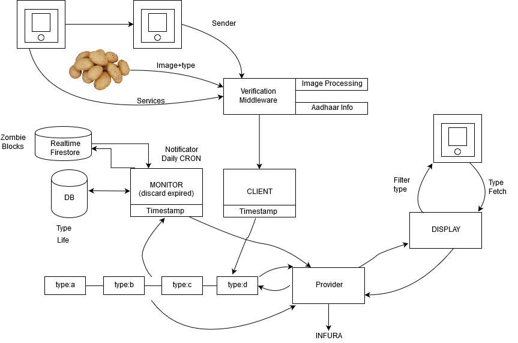

# Hector
A modern supply chain with auth

<br />

### Installing and compiling sol


```
go get -u github.com/ethereum/go-ethereum
cd $GOPATH/src/github.com/ethereum/go-ethereum/
make
make devtools
```

<br />

### Compiling sol and creating abi binding
```
cd chain
solc --abi Store.sol | awk '/JSON ABI/{x=1;next}x' > Store.abi
solc --bin Store.sol | awk '/Binary:/{x=1;next}x' > Store.bin
abigen --bin=Store_sol_Store.bin --abi=Store_sol_Store.abi --pkg=store --out=Store.go
```

<br />

### Module level workflow

<br />



<br />
<br />

### Auth service workflow

<br />


